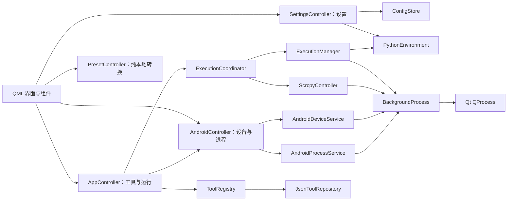

# PopTools 软件架构与产品边界

## 1. 文档目的

本文描述当前代码实际实现及 v1 产品边界，是开发、测试和发布验收的共同依据。历史设想不再作为实现要求；需求冲突时以自动化测试和本文件明确的范围为准。

## 2. 产品范围

主界面包含四个入口：

| 分区 | 当前范围 |
| --- | --- |
| 客制功能 | 用户可创建、编辑和删除 PowerShell、Bash、BAT、Python 命令 |
| 预设功能 | scrcpy、JSON 格式化/压缩/复制、时间戳转换、颜色输入、内嵌色盘与系统取色器 |
| 设置 | 外观、本地脚本导入导出、Python 运行时选择和诊断 |

明确不在范围内：

- 不注册或打包历史 Android 本地脚本；内置本地能力只保留 scrcpy。
- 不包含大模型日志分析器、报告生成器及其配套资源。
- 不保留 EX/EX-G、同步时间等已废弃脚本的迁移兼容层。
- 所有功能均在本机执行；`preset` 与 `custom` 只表示预置/客制来源，不表示网络边界。

## 3. 界面结构

窗口最小尺寸为 `720 × 448`。`Main.qml` 只负责窗口骨架、导航、工具列表和顶层对话框编排；独立功能放在组件中：

```text
src/poptools/ui/qml/
├─ Main.qml
├─ components/
│  ├─ PresetWorkspace.qml
│  ├─ CommandWorkspace.qml
│  ├─ SettingsDialog.qml
│  ├─ ExecutionCapacityDialog.qml
│  ├─ CommandEditorDialog.qml
│  ├─ ConfirmRunDialog.qml
│  ├─ DeleteToolDialog.qml
│  ├─ PythonDoctorDialog.qml
│  ├─ PythonRestartDialog.qml
│  ├─ ConsolePanel.qml
│  ├─ DeviceSelector.qml
│  └─ 其他通用控件
└─ theme/
   ├─ Theme.qml
   └─ qmldir
```

拆分边界以功能职责为准，避免把一次性转发属性或只有少量代码的片段继续抽象成组件。

## 4. 运行架构



职责说明：

- `AppController`：负责分区/工具选择、客制命令生命周期及运行操作，不承载设置、Android 刷新和预置转换逻辑。
- `SettingsController`：负责外观、窗口、本地脚本导入导出、Python 环境异步校验与应用重启。
- `PresetController`：负责 JSON 和时间戳等无外部状态的本地转换。
- `AndroidController`：负责设备选择、自动刷新和进程列表编排。
- `ToolRegistry`：组合内置定义、用户命令和用户覆盖；不承担进程运行。
- `ExecutionCoordinator`：统一普通任务并发配额、替换队列和 scrcpy 保留会话。
- `ExecutionManager`：根据执行器类型生成程序、参数和环境，并管理一次普通任务。
- `BackgroundProcess`：完全使用 Qt `QProcess` 接收输出、停止进程并发出完成信号。
- `ScrcpyController`：管理 scrcpy 的下载/解压状态和独立进程生命周期。
- `ConfigStore`：维护设置、导入导出和备份。
- `PythonEnvironment`：解析应用内置或用户自定义 Python 解释器。

不引入独立 Worker 协议或 Runner 接口层。入口保留的 `--worker`/`--worker-code` 只是打包程序执行 Python 文件或内联代码的兼容启动方式，不维护第二套任务协议；当前会话策略统一收敛在 `ExecutionCoordinator`，普通执行器分派收敛在 `ExecutionManager`。

## 5. 进程与 QObject 生命周期

普通任务由 `BackgroundProcess` 中的 `QProcess` 执行，输出、错误和结束状态均通过 Qt 事件循环处理，不创建 Python 读取线程。

生命周期约束：

1. `QProcess` 启动成功后才报告任务已开始。
2. 标准输出和错误输出在进程结束前后均被排空。
3. 收到 `finished` 后先清空控制器持有的进程引用，再调用 `deleteLater()`。
4. 停止任务时先请求终止，超时后强制结束；对象销毁不早于进程结束。
5. UI 和运行管理器只依赖完成信号，不跨线程直接销毁 `QObject`。
6. 设备扫描、Android 进程查询和 Python 解释器校验均异步执行，不在 UI 线程等待外部进程。

## 6. 并发配额

`execution.max_parallel` 默认值为 `3`，含义是产品总运行配额：

- scrcpy 固定占有 1 个保留配额；该配额不参与普通功能分配，也不能被普通功能抢占。
- 其他功能共享剩余 2 个配额，即 `max_parallel - 1`，最低为 1。
- 普通功能满额时不直接启动新任务。界面提示当前最早开始且仍在运行的功能名称，并询问是否停止它。
- 用户确认后，先停止该功能；收到完成信号后再启动新功能，避免短暂超配。
- 用户取消则保持现状，不启动新功能。

“最早开始”使用控制器分配的单调递增顺序判断，不依赖墙钟时间。

## 7. Python 运行时

项目构建和依赖管理使用 `.venv`。应用中的 Python 功能支持两种运行时：

- 应用内置运行时（`managed`）：打包时携带，安装后由应用准备和校验。
- 自定义运行时（`custom`）：用户选择本机 Python 可执行文件，保存前验证其可运行性。

选择结果写入配置；需要切换影响启动期环境的设置时，界面明确提示重启。业务代码不得硬编码某个开发机 Python 路径或固定的 Python 3.11 目录名。

## 8. 配置与工具存储

用户数据存放在应用数据目录，安装目录中的资源只读。

本地脚本导入采用“替换”语义，仅处理 `tools` 与 `scripts`，不会覆盖
`config.json` 中的外观、设备、窗口和 Python 等应用偏好：

1. 校验导入目录结构和工具 JSON 内容。
2. 为当前用户工具与脚本创建一次备份。
3. 清空当前 `tools` 与 `scripts`。
4. 复制导入内容并重新加载工具目录。

导入不是字段合并，避免遗留键和旧工具继续生效。损坏的用户工具 JSON 在首次发现时备份一次并移出加载路径，后续启动不重复生成相同备份。

配置关键项示例：

```json
{
  "execution": {
    "max_parallel": 3
  },
  "python": {
    "provider": "managed",
    "custom_executable": null
  }
}
```

## 9. 功能定义

### 9.1 客制功能

- 用户命令：PowerShell、Bash、BAT、Python。
- 客制命令使用统一的编辑、删除、参数模板和执行流程。
- 客制命令统一由 `ExecutionManager` 执行。

### 9.2 预设功能

- scrcpy 使用独立控制器和保留配额。
- JSON：格式化、压缩、复制结果；无效 JSON 返回行列信息。
- 时间戳：接受秒、毫秒或 ISO/本地日期时间，输出本地时间、秒和毫秒。
- 调色盘：接受 `#RRGGBB`、`#AARRGGBB`；内嵌色盘支持点击/拖动取色与 0–255 透明度，色值、选点及输入框前的颜色预览双向同步，并保留系统颜色选择器。

## 10. 资源管理

发布资源只保留运行时真实引用的内容：

- 应用图标与字体。
- scrcpy 压缩包、清单和许可证。
- Python 运行时清单与许可证。

源码仓库不提交 `*.egg-info` 等构建产物。删除功能时同时删除注册信息、脚本、UI 入口、测试和文档引用，防止“代码已停用但资源仍随包发布”。

## 11. 测试与验收

每次发布至少验证：

- `BackgroundProcess` 启动、输出、停止、异常和结束后的对象生命周期。
- 普通任务配额、最老任务名称提示、确认替换、取消不操作，以及 scrcpy 配额隔离。
- Python 内置/自定义运行时的选择、校验和持久化。
- 本地脚本导入完全替换 `tools` 与 `scripts`、备份一次、损坏工具隔离一次。
- JSON 复制、时间戳双向转换、颜色输入、内嵌色盘和系统取色器。
- QML 组件可加载，窗口在 `720 × 448` 下仍可操作。
- 安装包中不存在已移除的旧脚本、大模型分析器和重复构建资源。

当前不把静态类型门禁和控制台大输出性能改造列入本轮验收；它们作为独立后续工作处理。

## 12. 变更原则

- 功能范围优先于历史兼容；未进入测试范围的旧内置功能不保留影子实现。
- 同类执行逻辑优先复用 `ExecutionManager` 与 `BackgroundProcess`。
- 新增抽象必须解决已经存在的重复或隔离需求，不能只为假设性的未来变化增加层级。
- 需求变更时同步更新代码、资源、测试、README 和本文，确保只有一个有效定义。
