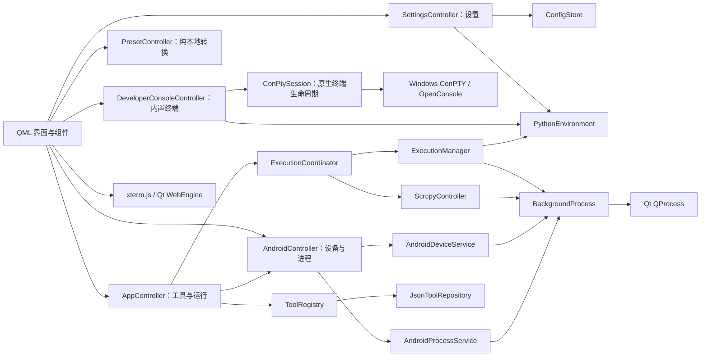

# PopTools 软件架构与产品边界

## 1. 文档目的

本文描述当前代码实际实现及 v1 产品边界，是开发、测试和发布验收的共同依据。历史设想不再作为实现要求；需求冲突时以自动化测试和本文件明确的范围为准。

## 2. 产品范围

主界面包含四个入口：

| 分区     | 当前范围 |
|----------| --- |
| 客制 | 用户可创建、编辑和删除 PowerShell、Bash、BAT、Python 命令 |
| 预设 | scrcpy、JSON 格式化/压缩/复制、时间戳转换、颜色输入、内嵌色盘与系统取色器 |
| 终端     | 可选安装官方 PowerShell 7 ZIP 插件后，使用应用专属 Python 环境的交互式终端，可直接执行 `python`、`pip` 和其他 PowerShell 命令 |
| 设置     | 外观、本地脚本导入导出和应用信息 |

明确不在范围内：

- 不注册或打包历史 Android 本地脚本；内置本地能力只保留 scrcpy。
- 不包含大模型日志分析器、报告生成器及其配套资源。
- 不保留 EX/EX-G、同步时间等已废弃脚本的迁移兼容层。
- 所有功能均在本机执行；`preset` 与 `custom` 只表示预置/客制来源，不表示网络边界。

## 3. 界面结构

窗口最小尺寸为 `960 × 720`，第三栏布局至少保留 `480 × 480` 的可用区域。`Main.qml` 只负责窗口骨架、导航、工具列表和顶层对话框编排；独立功能放在组件中：

```text
src/poptools/ui/qml/
├─ Main.qml
├─ components/
│  ├─ PresetWorkspace.qml
│  ├─ CommandWorkspace.qml
│  ├─ SettingsDialog.qml
│  ├─ ExecutionCapacityDialog.qml
│  ├─ CommandEditorDialog.qml
│  ├─ ConfirmRunDialog.qml
│  ├─ DeleteToolDialog.qml
│  ├─ PythonDoctorDialog.qml
│  ├─ ConsolePanel.qml
│  ├─ DeviceSelector.qml
│  └─ 其他通用控件
└─ theme/
   ├─ Theme.qml
   └─ qmldir
```

拆分边界以功能职责为准，避免把一次性转发属性或只有少量代码的片段继续抽象成组件。

## 4. 运行架构



应用对象的装配集中在 `poptools.application.bootstrap.build_components()`，返回
`ApplicationComponents` 作为长生命周期对象图。`poptools.main` 只负责 Qt 生命周期、单实例、系统托盘和 QML 绑定，不再直接创建各项业务依赖。

依赖规则如下：

- `domain` 只包含模型、规则和协议，不依赖 Qt 或具体文件实现。
- `application` 是组合根，负责把基础设施适配器注入到运行协调器和 ViewModel。
- `viewmodels` 是 QML 的表现层适配器，负责属性、信号和用户交互编排。
- `infrastructure` 提供文件存储、QProcess、Android、Python 和 Windows 适配器。
- `runners` 管理执行生命周期；它仍是独立的运行时子系统，后续若出现第二种前端可直接复用。

该方案是渐进式架构优化：保留现有导入路径和行为契约，只把最容易扩散的对象装配职责收敛到应用组合根。

职责说明：

- `AppController`：负责分区/工具选择、客制命令生命周期及运行操作，不承载设置、Android 刷新和预置转换逻辑。
- `SettingsController`：负责外观、窗口、本地脚本导入导出、Python 环境异步校验与应用重启。
- `PresetController`：负责 JSON 和时间戳等无外部状态的本地转换。
- `AndroidController`：负责设备选择、自动刷新和进程列表编排。
- `DeveloperConsoleController`：控制可选 PowerShell 7 插件的安装门禁与内置会话，把 `python` 与 `pip` 绑定到应用专属环境，并限制终端回放数据的内存占用。
- `ConPtySession`：直接使用 pywinpty 底层 `PTY` 驱动 Windows ConPTY，不使用 `PtyProcess` 的中间 socket 和额外 Python 读取线程；负责输出读取、尺寸同步和整个终端进程树回收。
- `ToolRegistry`：组合内置定义、用户命令和用户覆盖；不承担进程运行。
- `ExecutionCoordinator`：统一普通任务并发配额、替换队列和 scrcpy 保留会话。
- `ExecutionManager`：根据执行器类型生成程序、参数和环境，并管理一次普通任务。
- `BackgroundProcess`：完全使用 Qt `QProcess` 接收输出、停止进程并发出完成信号。
- `ScrcpyController`：管理 scrcpy 的下载/解压状态和独立进程生命周期。
- `ConfigStore`：维护设置、导入导出和备份。
- `PythonEnvironment`：准备应用内置 Python 运行时和用户专属 venv，为依赖检查、安装、终端和脚本执行提供一致环境。

不引入独立 Worker 协议或 Runner 接口层。入口保留的 `--worker`/`--worker-code` 只是打包程序执行 Python 文件或内联代码的兼容启动方式，不维护第二套任务协议；当前会话策略统一收敛在 `ExecutionCoordinator`，普通执行器分派收敛在 `ExecutionManager`。

## 5. 进程与 QObject 生命周期

普通任务由 `BackgroundProcess` 中的 `QProcess` 执行，输出、错误和结束状态均通过 Qt 事件循环处理，不创建 Python 读取线程。

生命周期约束：

1. `QProcess` 启动成功后才报告任务已开始。
2. 标准输出和错误输出在进程结束前后均被排空。
3. 收到 `finished` 后先清空控制器持有的进程引用，再调用 `deleteLater()`。
4. 停止任务时先请求终止，超时后强制结束；对象销毁不早于进程结束。
5. UI 和运行管理器只依赖完成信号，不跨线程直接销毁 `QObject`。
6. 设备扫描、Android 进程查询和 Python 解释器校验均异步执行，不在 UI 线程等待外部进程。

内置 PowerShell 终端采用独立的生命周期约束：

1. 终端功能由持久化配置 `app.terminal_enabled` 控制，默认关闭；主界面“终端”Tab 只有在该配置开启且 PowerShell 插件有效时才显示。
2. 用户只能从设置页请求开启终端。插件不存在时先进入安装确认流程；拒绝或取消不修改配置，安装成功后才保存开启状态。
3. `DeveloperConsole` 作为主界面的持久组件存在，避免反复创建 WebEngine 原生表面造成白色窗口闪烁。
4. 首次进入页面后启动 `pwsh.exe`；切换主界面分区不会停止会话。用户从设置关闭终端时停止当前会话并隐藏 Tab，真正退出应用时由 `aboutToQuit` 统一关闭。
5. PowerShell 进程加入 Windows Job Object；会话结束时同时终止进程树，并显式回收该会话创建的 `OpenConsole.exe` 宿主。
6. `ConPtySession` 只使用一个 Qt 工作线程读取底层 PTY，不创建中间本地 socket 或第二个 Python 读取线程。
7. Qt 线程结束后释放 PTY、Job Object 与控制器引用，再通过 `deleteLater()` 销毁 QObject。
8. 应用退出、页面最终销毁前断开 `ResizeObserver` 和输入订阅，并调用 `terminal.dispose()`。
9. 控制器最多保存最近 `131072` 字符的终端回放数据，避免 Python 字符串无界增长。
10. PTY 采用非阻塞读取；空闲读取异常只有在进程确认退出后才结束工作线程，不能把无输入状态误判为 PowerShell 退出，也不自动重启异常结束的会话。

## 6. 并发配额

`execution.max_parallel` 默认值为 `3`，含义是产品总运行配额：

- scrcpy 固定占有 1 个保留配额；该配额不参与普通功能分配，也不能被普通功能抢占。
- 其他功能共享剩余 2 个配额，即 `max_parallel - 1`，最低为 1。
- 普通功能满额时不直接启动新任务。界面提示当前最早开始且仍在运行的功能名称，并询问是否停止它。
- 用户确认后，先停止该功能；收到完成信号后再启动新功能，避免短暂超配。
- 用户取消则保持现状，不启动新功能。

“最早开始”使用控制器分配的单调递增顺序判断，不依赖墙钟时间。

## 7. Python 运行时

项目构建和依赖管理使用 `.venv`。发布后的应用统一使用打包时携带、安装后由应用准备和校验的内置运行时，并在用户数据目录创建专属 venv。Python Doctor、内置终端、应用内 pip 安装和脚本运行共享该环境；业务代码不得硬编码开发机 Python 路径或固定 Python 版本目录。

新建、编辑和运行 Python 脚本时会分析 `import`。标准库与脚本旁本地模块会被排除；缺失的常见第三方模块通过映射表转换为 pip 包名，用户确认后安装到专属 venv，并在安装完成后重新检查。

PowerShell 7 不随主安装包直接展开。用户在设置中开启终端功能时，可确认安装固定版本的微软官方 ZIP 发行包。拒绝或取消安装时保持关闭；下载、校验、路径安全检查和原子解压全部完成后才持久化开启状态并显示主界面“终端”Tab。插件清单固定版本、架构、下载地址和 SHA-256，安装目录位于 `%LOCALAPPDATA%\PopTools\plugins\powershell`，运行时不回退到系统 `pwsh` 或 Windows PowerShell。关闭终端功能只隐藏入口并停止会话，不删除插件。

终端渲染由 Qt WebEngine 中的离线 xterm.js 完成，输入逐键发送到 ConPTY，因此 PowerShell 能识别真实交互式终端并启用 PSReadLine。会话跨主界面分区持续存在，在用户点击“重启会话”或真正退出应用时确定性回收内存、线程和进程资源。

## 8. 配置与工具存储

用户数据存放在应用数据目录，安装目录中的资源只读。

本地脚本导入采用“替换”语义，仅处理 `tools` 与 `scripts`，不会覆盖
`config.json` 中的外观、设备、窗口和 Python 等应用偏好：

1. 校验导入目录结构和工具 JSON 内容。
2. 为当前用户工具与脚本创建一次备份。
3. 清空当前 `tools` 与 `scripts`。
4. 复制导入内容并重新加载工具目录。

导入不是字段合并，避免遗留键和旧工具继续生效。损坏的用户工具 JSON 在首次发现时备份一次并移出加载路径，后续启动不重复生成相同备份。

配置关键项示例：

```json
{
  "execution": {
    "max_parallel": 3
  },
  "python": {
    "provider": "managed"
  }
}
```

## 9. 功能定义

### 9.1 客制

- 用户命令：PowerShell、Bash、BAT、Python。
- 客制命令使用统一的编辑、删除、参数模板和执行流程。
- 客制命令统一由 `ExecutionManager` 执行。

### 9.2 预设

- scrcpy 使用独立控制器和保留配额。
- JSON：格式化、压缩、复制结果；无效 JSON 返回行列信息。
- 时间戳：接受秒、毫秒或 ISO/本地日期时间，输出本地时间、秒和毫秒。
- 调色盘：接受 `#RRGGBB`、`#AARRGGBB`；内嵌色盘支持点击/拖动取色与 0–255 透明度，色值、选点及输入框前的颜色预览双向同步，并保留系统颜色选择器。

## 10. 资源管理

发布资源只保留运行时真实引用的内容：

- 应用图标与字体。
- scrcpy 压缩包、清单和许可证。
- Python 运行时清单与许可证。

源码仓库不提交 `*.egg-info` 等构建产物。删除功能时同时删除注册信息、脚本、UI 入口、测试和文档引用，防止“代码已停用但资源仍随包发布”。

## 11. 测试与验收

每次发布至少验证：

- `BackgroundProcess` 启动、输出、停止、异常和结束后的对象生命周期。
- 普通任务配额、最老任务名称提示、确认替换、取消不操作，以及 scrcpy 配额隔离。
- Python 内置/自定义运行时的选择、校验和持久化。
- 本地脚本导入完全替换 `tools` 与 `scripts`、备份一次、损坏工具隔离一次。
- JSON 复制、时间戳双向转换、颜色输入、内嵌色盘和系统取色器。
- QML 组件可加载，窗口在 `960 × 720` 下仍可操作，第三栏不小于 `480 × 480`。
- 内置终端反复启停后不残留 `pwsh.exe`、`OpenConsole.exe`、Qt 线程对象或控制器子对象。
- 终端大输出受回放上限约束，页面未挂载时不持续向 QML 发送输出事件。
- 安装包中不存在已移除的旧脚本、大模型分析器和重复构建资源。

终端生命周期和大输出性能属于发布验收范围；相关改动必须通过重复会话资源回收测试。全项目静态类型遗留问题仍作为独立后续工作处理。

## 12. 变更原则

- 功能范围优先于历史兼容；未进入测试范围的旧内置功能不保留影子实现。
- 同类执行逻辑优先复用 `ExecutionManager` 与 `BackgroundProcess`。
- 新增抽象必须解决已经存在的重复或隔离需求，不能只为假设性的未来变化增加层级。
- 需求变更时同步更新代码、资源、测试、README 和本文，确保只有一个有效定义。
