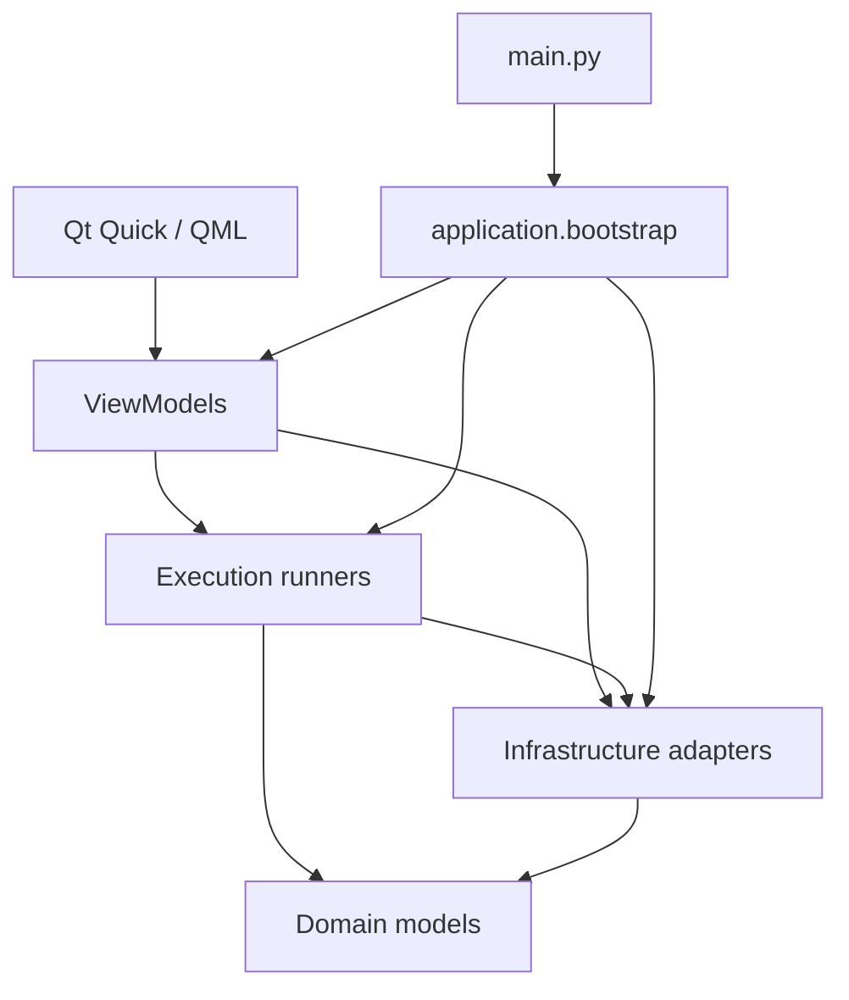

# PopTools 软件设计文档

## 1. 文档信息

| 项目 | 内容 |
| --- | --- |
| 适用版本 | `1.0.9` |
| 基线日期 | 2026-09-03 |
| 目标平台 | Windows 10/11 x64、macOS 12+ arm64/x64 |
| 开发环境 | Python 3.11、PySide6、Qt Quick/QML |
| 运行基础 | Windows ConPTY / macOS PTY、ADB、scrcpy、应用专属 Python |

本文描述 1.0.9 当前实现，是功能边界、运行链路、数据所有权、主题、终端、更新与发布的设计依据。

## 2. 产品结构

PopTools 是单机桌面工具箱，功能按来源分为三类：

| 分区 | 当前能力 |
| --- | --- |
| 客制 | PowerShell、Bash、BAT、Python 脚本的创建、编辑、删除、搜索、排序、参数化、运行与迁移 |
| 预设 | Android 设备投屏、画面/音频/logcat 联合录制、调色盘、Jira 飞书推送 |
| 基础能力 | Android 设备选择、运行配额、控制台、Python 环境、可选终端、主题、更新、托盘与单实例 |

主导航包含“客制”“预设”“设置”，终端启用且运行环境可用后增加“终端”入口。设置通过弹窗展示，不占用工作区页面。

## 3. 设计原则

- 用户数据与包内只读资源分离，升级应用不覆盖客制脚本。
- QML 负责显示和交互，状态与业务编排由 ViewModel 暴露。
- 文件、进程、网络、平台 API 和原生窗口封装在基础设施或运行层。
- 所有长生命周期对象由应用组合根创建和连接。
- 长任务通过 Qt 事件循环或工作线程执行，不阻塞界面线程。
- 主题加载与业务配置隔离，主题文件异常不得阻断工具模型初始化。
- 进程、线程、PTY、原生窗口和临时文件必须有明确回收路径。

## 4. 分层与组合根



| 层 | 职责 |
| --- | --- |
| `domain` | 工具、执行器、参数、展示模型，模板解析与仓库协议 |
| `application` | 创建应用对象图并声明对象所有权 |
| `viewmodels` | 页面状态、用户动作、异步流程和 QML 信号/属性 |
| `runners` | 脚本执行、并发策略、scrcpy 会话与输出路由 |
| `infrastructure` | JSON 存储、Android、Python、终端、网络更新、托盘、主题目录和平台集成 |
| `ui/qml` | 主窗口、工作区、抽屉、对话框和主题化组件 |

`build_components()` 创建并连接以下长生命周期对象：

- `ConfigStore`
- `JsonToolRepository` 与 `ToolRegistry`
- `PythonEnvironment`
- `ExecutionManager` 与 `ExecutionCoordinator`
- `AndroidController`
- `AppController`
- `SettingsController`
- `PresetController`
- `JiraFeishuController`
- `DeveloperConsoleController`
- `UpdateController`

`main.py` 负责日志、单实例、Qt 初始化、字体和图标、包内 Android/Python 运行时准备、QML 上下文绑定、托盘及退出清理。

## 5. 界面结构

主窗口最小尺寸为 `960 × 720`，内容区至少保留 `480 × 480`。窗口宽度不足时，主导航和预设工具列表进入紧凑模式。

```text
src/poptools/ui/qml/
├─ Main.qml                         # 主窗口、左侧导航、页面路由和顶层弹窗
├─ components/
│  ├─ CustomScriptsPage.qml         # 客制脚本网格、搜索和详情抽屉
│  ├─ PresetFunctionsPage.qml       # 预设侧栏、搜索和预设工作区
│  ├─ TerminalPage.qml              # 终端页面边界
│  ├─ ToolDetailPanel.qml           # 客制与预设共用的工具详情区域
│  ├─ CommandWorkspace.qml          # 客制脚本参数和运行内容
│  ├─ PresetWorkspace.qml           # 预设工作区路由
│  ├─ RecordingWorkspace.qml        # Android 联合录制
│  ├─ InteractiveColorPicker.qml    # 调色盘和系统取色
│  ├─ JiraFeishuWorkspace.qml       # Jira 飞书配置与调度
│  ├─ DeveloperConsole.qml          # 原生终端界面
│  ├─ SettingsDialog.qml            # 设置与手动更新检查
│  ├─ UpdateDialog.qml              # Release Notes、下载与安装
│  ├─ CommandEditorDialog.qml       # 客制脚本编辑器
│  ├─ CustomScriptImportDialog.qml  # 单脚本重复 ID 确认
│  ├─ AppPopupSurface.qml           # 主题化弹层表面与阴影
│  └─ 其他通用按钮、列表和确认弹窗
└─ theme/
   ├─ Theme.qml                     # 运行时语义令牌
   ├─ ThemeConfig.qml               # 通用主题应用器
   └─ configs/*.json                # 可发现的主题定义
```

主窗口使用无边框窗口和自定义标题栏。左侧导航切换三个独立页面组件，页面根节点占满工作区且不设置外边距；页面内容统一使用 `Theme` 中以 4 像素为步进、最大 40 像素的间距令牌。客制脚本详情显示为右侧抽屉；运行按钮、操作按钮、主页工具按钮和弹层圆角均从主题令牌读取。

## 6. 工具模型与存储

`ToolDefinition` 是预设与客制工具的统一模型，主要包含：

- `id`、版本、来源、分区、名称、说明、标签和启用状态；
- 执行器类型、命令、参数、工作目录、超时、编码、环境变量和依赖要求；
- 参数定义；
- 图标、顺序、运行确认和输出方式。

包内 `resources/tools/*.json` 是预设定义。`JsonToolRepository` 读取用户的 `tools/custom` 与 `tools/overrides`，通过 Pydantic 校验后交给 `ToolRegistry` 合并。无效 JSON 会先备份再隔离，避免一份损坏配置阻断其余工具加载。

客制脚本创建时生成 `custom.<uuid>` ID。编辑会递增 revision 并重新同步参数；删除前后保持文件备份。脚本排序状态、添加时间、使用次数、自定义顺序和最近使用记录保存在 `config.json` 的 `custom_tools` 节点。

## 7. 客制脚本交互

### 7.1 列表与抽屉

客制主页以自适应网格显示脚本，并提供：

- 按名称、说明或运行方式搜索；
- 按添加时间、名称、使用频率或自定义顺序排序；
- 在自定义排序模式下拖动调整顺序；
- 从剪贴板导入脚本；
- 新建脚本。

点击脚本后打开详情抽屉。抽屉顶部提供关闭、分享、删除和编辑按钮，运行按钮右对齐并与顶部操作组等宽。抽屉继续展示参数、运行状态和控制台输出。

### 7.2 参数模板

`domain.parameter_templates` 从命令文本提取占位符：

- `${名称}`：文本参数；
- `${名称:默认值}`：带默认值的文本参数；
- `${名称:标签=值|标签=值}`：选择参数；
- `pVal 内部名 = ${显示名称:定义}`：声明可复用参数别名。

执行前先移除 `pVal` 元数据行，再根据当前值渲染脚本文本。客制文本参数可以把当前输入保存回模板默认值，选择参数保留既有选项定义。

### 7.3 单脚本剪贴板迁移

分享动作使用 `poptools.custom-script`、格式版本 1 和完整 `ToolDefinition` 生成 JSON。导入按以下顺序处理：

1. 解析 JSON、校验格式标识和版本；
2. 校验工具模型、客制分区、执行器与非空命令；
3. 新 ID 直接追加；
4. 相同客制 ID 请求用户确认替换；
5. 与预设 ID 冲突或目标脚本正在运行时拒绝替换。

### 7.4 批量迁移

设置页批量导出用户数据目录中的 `tools` 和 `scripts`。批量导入要求来源目录包含至少一个相同入口，并执行“校验来源 → 备份现有内容 → 合并导入”。同路径文件采用导入版本，未冲突的本地脚本保留，应用偏好与其他业务配置不参与迁移。

## 8. 执行与并发

`ExecutionManager` 根据 PowerShell、Bash、Batch 或 Python 执行器生成程序、参数、工作目录和环境，通过 `BackgroundProcess`/`QProcess` 异步运行。输出、错误、启动、停止和完成信号均进入 Qt 事件循环。

`ExecutionCoordinator` 维护普通任务会话和 scrcpy 保留会话：

- 客制脚本并发数可设置为 1–5，默认 2；
- scrcpy 使用独立保留名额；
- 同一个工具不能重复运行；
- 普通名额满时提示最早启动的任务；
- 用户确认后先停止旧任务，收到完成信号后再启动新任务；
- 用户取消时保持现有任务不变。

普通任务停止时先请求终止，必要时结束进程树。输出目录按执行生成并在无持久文件时清理。

## 9. Android 与预设能力

### 9.1 设备与投屏

`AndroidDeviceService` 异步刷新 ADB 设备，`AndroidController` 保存首选设备。需要 Android 的预设和包含 ADB 的客制脚本使用全局所选设备。

ADB 与 scrcpy 从经过清单和 SHA-256 校验的包内归档准备到版本化运行目录。`ScrcpyController` 管理独立进程、嵌入式原生窗口和 QML 内容区几何同步。

### 9.2 联合录制

`PresetController` 协调设备端 `screenrecord`、系统/麦克风音频和 logcat。流程包括清空日志、启动采集、停止各进程、拉取设备日志、等待文件完成、选择保存目录和清理临时/远端文件。保存目录使用 `YYYY-MM-DD-HH-MM` 命名。

### 9.3 调色盘

`InteractiveColorPicker` 支持 `#RRGGBB` 和 `#AARRGGBB`，同步色相、饱和度、明度、透明度与 RGB 显示。`ScreenColorPicker` 通过全屏取色窗口读取屏幕像素，完成或取消后恢复应用状态。

### 9.4 Jira 飞书推送

`JiraFeishuController` 与 `JiraFeishuProfileStore` 管理多方案配置。每个方案包含 Jira、飞书、消息与调度设置，保存在用户数据目录的 `jira_feishu/profiles.json`。

控制器提供 Jira 连接测试、消息预览、立即推送和串行任务日志。调度器支持分钟间隔与每日多个 `HH:mm` 时刻；窗口隐藏到托盘时进程仍在，因此调度继续运行，应用退出时停止线程和定时器。

## 10. Python 环境

发布包携带清单描述的 Python 运行时，在用户数据目录准备私有 runtime 与 venv。`PythonEnvironment` 统一向以下消费者提供解释器、pip 和环境变量：

- 客制 Python 脚本；
- Python Doctor；
- 自动依赖安装；
- 内置终端中的 `python` 与 `pip`。

Python Doctor 支持内联源码和 `.py` 文件路径，解析 import、排除标准库与脚本同目录模块、探测已安装模块，并将常见导入名映射到 pip 包名。安装必须由用户确认，过程异步输出到控制台，完成后重新检查。

## 11. 内置终端

终端由 `app.terminal_enabled` 控制，默认关闭。Windows 首次启用时，`PowerShellPlugin` 根据架构清单下载官方 PowerShell ZIP，校验 SHA-256、安全解压并写入安装清单；macOS 直接使用用户系统 Shell。

`DeveloperConsoleController` 最多维护 7 个 `TerminalTabState`，每个标签页独立持有 Shell 会话、解码器、输出快照和退出状态。切换应用页面不会销毁会话；关闭标签、重启当前会话、关闭终端功能或退出应用时按作用域回收资源。

`TerminalItem` 基于 libvterm 渲染字符网格并处理键盘、输入法、鼠标、选区、剪贴板和滚动。Windows 使用 ConPTY 与 Job Object，macOS 使用 POSIX PTY。控制器输出快照上限为 131,072 字符，原生终端每个会话保留最多 10,000 行回滚记录。

快捷键策略：

- `Ctrl+C` 有选区时复制，无选区时向当前会话发送 `0x03`；
- `Ctrl+V` 粘贴剪贴板；
- `Ctrl+X` 仅在有选区时执行复制并清除选区；
- `Ctrl+L` 向 Shell 发送清屏控制；
- `Ctrl+Shift+C/V/X` 与 Insert 组合键作为兼容操作保留。

右键菜单使用 `AppPopupSurface` 和 `Theme` 语义颜色、圆角、边框、阴影及交互状态。

## 12. 动态主题

主题定义位于 `ui/qml/theme/configs/*.json`。主题 ID 是文件名，显示名称来自 JSON 的 `name`。当前包内提供 `material3`、`winxp` 和 `mario`。

`ThemeCatalog` 独立于 `ConfigStore`：

1. 应用启动时扫描主题目录；
2. 每次设置弹窗打开时重新扫描；
3. 校验主题 ID、名称、浅色颜色、深色颜色和完整圆角字段；
4. 无效主题不进入列表；
5. 已保存主题不可用时解析为 `material3`；
6. `ConfigStore` 只保存安全格式的主题 ID，不读取主题文件。

`SettingsController.themeStyles` 以带通知信号的动态列表提供给 QML。`ThemeConfig.qml` 是通用应用器，将已验证配置一次性写入 `Theme.qml` 的主色、次要色、第二次要色、表面、状态色、控制台色和圆角令牌。主题切换不访问工具仓库、客制脚本或 Jira 飞书配置。

## 13. 设置与用户数据

`AppPaths` 解析用户数据根目录：

```text
Windows: %LOCALAPPDATA%\PopTools
macOS:   ~/Library/Application Support/PopTools
```

主要目录结构：

```text
PopTools/
├─ config.json
├─ tools/custom/
├─ tools/overrides/
├─ scripts/
├─ outputs/
├─ backups/
├─ logs/
├─ jira_feishu/
├─ runtime/
├─ python/runtime/
├─ python/venv/
├─ plugins/powershell/
└─ updates/
```

`ConfigStore` 只保存应用偏好、执行配额、设备选择、主题 ID、终端开关、更新渠道和客制列表元数据。主题目录扫描、工具 JSON 和 Jira 飞书方案由各自服务管理，避免一个配置链路异常影响其他业务。

## 14. 更新、单实例与托盘

`SingleInstanceLock` 以数据目录为作用域确保单实例，后续启动请求会激活已有窗口。

系统托盘提供显示主界面、预设功能、最近使用客制脚本和退出。窗口关闭默认隐藏到托盘；真正退出时统一清理终端、更新、Jira 飞书线程和应用资源。

更新流程：

1. 冷启动后异步检查，成功检查后 24 小时内不重复自动请求；
2. 正式渠道读取 `/releases/latest`；测试渠道读取最近 5 个 Release；
3. 忽略 draft，按当前平台资产名筛选并按版本键选择最高版本；
4. 更新弹窗直接渲染 Release body 的 Markdown，内容高度自适应并限制在 600 像素窗口上限内；
5. 用户可以跳过版本、下载、取消、稍后安装或安装并重启；
6. 下载校验 Content-Length、GitHub digest 或配套 SHA-256；
7. Windows 通过外部 PowerShell 替换 EXE，macOS 通过外部脚本替换应用包 Contents 并重启。

网络错误只更新状态，不阻断本地功能启动。

## 15. 测试与验收

开发提交至少执行：

```powershell
.\.venv\Scripts\python.exe -m pytest
.\.venv\Scripts\ruff.exe check src tests
```

QML 变更还需执行 `pyside6-qmllint`，并通过 `tests/capture_ui.py` 做离屏启动或视觉检查。主要测试范围：

- 工具模型、参数模板、仓库与损坏配置隔离；
- 客制创建、编辑、删除、排序、运行和单脚本/批量迁移；
- 并发替换与 scrcpy 独立配额；
- Android 设备、投屏和录制流程；
- Python 环境、Doctor 与依赖安装；
- Jira 飞书配置、卡片生成和调度；
- 动态主题扫描、校验、回退以及浅色/深色应用；
- 终端多标签、输入输出、中断和会话回收；
- 正式/测试更新渠道、Release Notes、下载校验和安装；
- QML 最小窗口、紧凑布局、抽屉和弹窗。

## 16. 构建与发布

Windows：

```powershell
.\packaging\build.ps1
```

macOS：

```bash
./packaging/build.sh
```

版本以 `pyproject.toml` 为语义版本来源。构建时生成 `YYYY-MM-DD_x.x.x` 完整版本，Git 标签为 `vYYYY-MM-DD_x.x.x`。GitHub Actions 并行构建：

- Windows x64：`PopTools.exe`、安装包和 SHA-256；
- macOS arm64：`PopTools-macos-arm64.zip` 和 SHA-256；
- macOS x64：`PopTools-macos-x64.zip` 和 SHA-256。

发布工作流校验 OTA 文件后创建正式 Release 或 prerelease，并使用 GitHub 生成的 Release Notes。

## 17. 变更约束

- 新功能必须归入客制、预设或基础能力，并明确数据所有者。
- 新外部下载必须使用 HTTPS、完整性校验和安全解压。
- 新进程、线程或原生资源必须定义启动、取消、异常和退出路径。
- 配置格式变更必须兼容现有用户数据，必要时先备份再迁移。
- 主题新增或修改通过 JSON 配置完成，并满足目录服务的完整字段校验。
- 用户可见行为变更必须同步更新 README、软件设计文档、应用内引导和测试。
