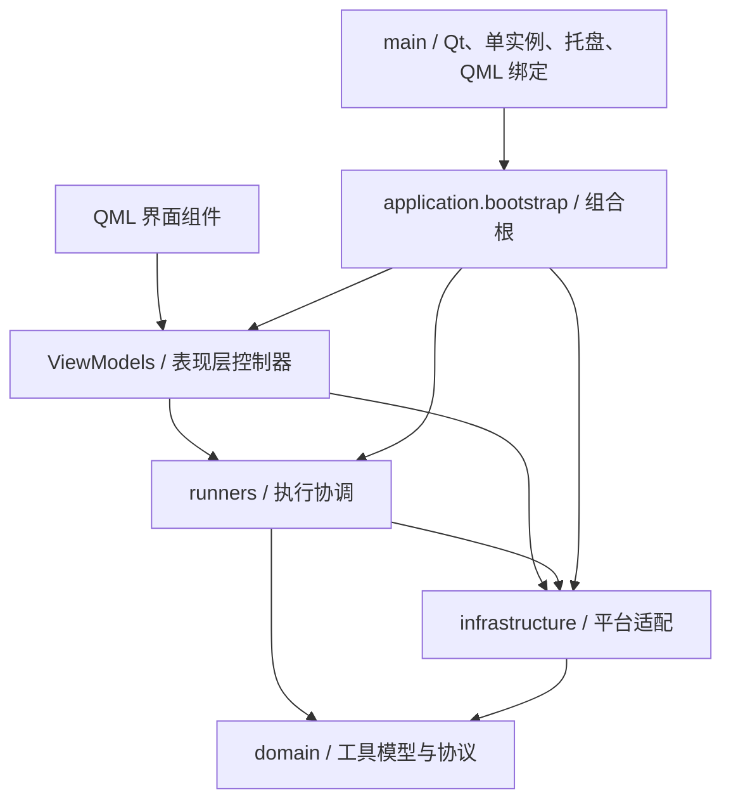

# PopTools 软件设计文档

## 1. 文档信息

| 项目 | 内容 |
| --- | --- |
| 适用代码 | `0.2.0_beta` |
| 基线日期 | 2026-08-17 |
| 目标平台 | Windows 10/11、macOS 12+（Apple Silicon 与 Intel） |
| 技术栈 | Python 3.11、PySide6、Qt Quick/QML、Windows ConPTY / macOS PTY |
| 文档角色 | 当前实现、架构约束、重构决策、构建发布和后续优化的唯一设计说明 |

本文以当前仓库代码为准，合并原软件架构设计与“应用组合根”重构说明。历史界面基线、设计验收记录和独立 ADR 不再作为现行设计依据。

## 2. 产品边界与功能分区

PopTools 是单机、单用户的 Android 开发与测试工具箱。所有工具均在本机执行，不存在 online/local 两套运行模式。系统按能力来源和职责划分：

| 分区 | 定义 | 当前能力 |
| --- | --- | --- |
| 预设功能 | 随应用发布、用户不可编辑的内建能力 | Android 投屏、录屏与 logcat、JSON、时间戳、调色盘、Jira 飞书推送 |
| 客制功能 | 用户创建并持久化的脚本 | PowerShell、Bash、BAT、Python，参数模板，导入导出 |
| 基础能力 | 为两类工具提供的公共运行环境 | 设备选择、执行配额、控制台、Python 环境、可选终端、托盘、更新、主题与配置 |

“预设”和“客制”只描述功能来源，不描述网络边界。工具内容、参数、输出和 Android 操作不上传。网络访问限定在两类基础设施行为：用户确认安装 PowerShell 7 插件，以及发布版检查和下载公开软件更新。

当前不保留已废弃 Android 脚本、大模型日志分析器、报告生成器或对应兼容层。删除功能时必须同时删除注册、资源、界面入口、测试和文档引用。

## 3. 设计目标

- 用户数据与只读发布资源分离，升级应用不覆盖客制内容。
- QML 只承担显示和交互，业务状态通过 ViewModel 暴露。
- 外部进程、文件、网络和平台 API 收敛在基础设施或运行子系统。
- 所有具体对象只在组合根装配，入口文件只管理桌面生命周期。
- 用实际重复和替换需求驱动抽象，避免为假设场景增加空接口或空泛 Service 层。
- 长任务不得阻塞 UI；进程、线程、原生窗口和 WebEngine 资源必须可确定回收。

## 4. 总体架构



### 4.1 依赖规则

| 层 | 职责 | 约束 |
| --- | --- | --- |
| `domain` | 工具定义、枚举、验证规则和仓库协议 | 不依赖 Qt、文件系统、Windows 或具体存储 |
| `application` | 应用组合根和对象图 | 唯一了解全部具体实现的层 |
| `viewmodels` | QML 属性、信号与交互编排 | 不直接决定文件格式或启动平台进程 |
| `runners` | 工具启动、并发配额和运行会话 | 复用领域模型与基础设施适配器 |
| `infrastructure` | JSON、配置、QProcess、Android、Python、ConPTY、更新、托盘 | 封装外部系统细节 |
| `ui/qml` | 页面、组件、主题和对话框 | 不持久化业务数据，不自行创建后端服务 |

`infrastructure` 实现领域协议并由组合根向上注入，不表示领域层依赖基础设施。当前保留既有目录和导入路径，避免一次性迁移造成无收益的破坏。

### 4.2 应用组合根

`poptools.application.bootstrap.build_components()` 集中创建并连接长生命周期对象，返回 `ApplicationComponents`：

- `ConfigStore`
- `ToolRegistry` 与 `JsonToolRepository`
- `ExecutionManager` 与 `ExecutionCoordinator`
- `AndroidController`
- `AppController`
- `SettingsController`
- `PresetController`
- `DeveloperConsoleController`
- `UpdateController`

`poptools.main` 仅处理命令行兼容入口、日志、单实例、Qt/WebEngine 初始化、内置运行时准备、系统托盘、QML 上下文绑定和退出清理。构造依赖不得重新散落回 `main` 或 QML。

## 5. 界面设计

主窗口最小尺寸为 `960 × 720`，内容区至少保留 `480 × 480`。宽度不足时，导航和工具列表进入紧凑模式。

```text
src/poptools/ui/qml/
├─ Main.qml                       # 窗口、导航、工具列表、顶层弹窗编排
├─ components/
│  ├─ CommandWorkspace.qml        # 客制脚本参数与运行区
│  ├─ PresetWorkspace.qml         # JSON、时间戳、调色盘
│  ├─ RecordingWorkspace.qml      # Android 录制状态与保存
│  ├─ DeveloperConsole.qml        # xterm.js 终端承载
│  ├─ SettingsDialog.qml
│  ├─ CommandEditorDialog.qml
│  ├─ PythonDoctorDialog.qml
│  ├─ UpdateDialog.qml
│  ├─ UserGuideDialog.qml
│  ├─ RecentToolDialog.qml
│  └─ 通用按钮、列表、选择器和确认弹窗
└─ theme/
   ├─ Theme.qml                   # 深浅色语义令牌
   └─ qmldir
```

颜色必须使用 `Theme` 的语义令牌，如 `textPrimary`、`textSecondary`、`surface`、`outlineVariant`、`primary` 和 `errorColor`。组件不得假设固定浅色背景或把浅色文本写死；自定义中栏颜色的前景色由对比度计算结果提供。主题验收以自动化对比度测试和实际组件状态为准，不再维护截图式视觉基线。

## 6. 核心组件职责

### 6.1 表现层控制器

- `AppController`：分区与工具选择、搜索/排序数据、客制工具生命周期、最近使用和普通运行交互。
- `SettingsController`：外观、窗口、终端开关、并发数、用户引导状态、本地脚本导入导出、Python 环境检查和应用重启。
- `PresetController`：屏幕取色和 Android 录制流程。
- `JiraFeishuController`：Jira/飞书多方案配置、串行推送任务、日志与应用内定时调度。
- `AndroidController`：设备选择、自动刷新和 Android 进程列表。
- `DeveloperConsoleController`：PowerShell 插件门禁、ConPTY 会话、终端输入输出与回放上限。
- `UpdateController`：异步检查、下载进度、跳过版本、安装并重启。

### 6.2 领域、存储与注册

`ToolDefinition` 是预设与客制工具的统一模型，包含来源、分区、执行器、参数与展示信息。安装目录中的预设 JSON 是只读资源；用户创建的工具和覆盖写入 `%LOCALAPPDATA%\PopTools\tools`。

`ToolRegistry` 负责合并预设定义、用户工具和覆盖，并提供查询、创建、修改、重置和删除能力。它依赖领域层 `ToolRepository` 协议；当前适配器是 `JsonToolRepository`。JSON 适合当前低频写入、启动时整体加载的单机规模。只有出现数千级分页查询、执行历史/版本事务或多进程并发写入等可测需求时，才重新评估 SQLite；迁移必须保留已校验的 JSON 备份。

### 6.3 配置与用户数据

`AppPaths` 统一解析数据目录；Windows 默认根目录为 `%LOCALAPPDATA%\PopTools`，macOS 为 `~/Library/Application Support/PopTools`：

```text
PopTools/
├─ config.json
├─ tools/custom/
├─ tools/overrides/
├─ scripts/
├─ outputs/
├─ backups/
├─ logs/
├─ runtime/
├─ python/runtime/
├─ python/venv/
├─ plugins/powershell/
└─ updates/
```

发布资源从包内只读目录加载，运行时和用户写入不得落到安装目录。脚本导入采用“先校验、再备份、后合并”语义，将 `tools` 与 `scripts` 合并进现有目录，同名文件使用导入版本，不覆盖 `config.json` 中的偏好。损坏工具配置首次发现时只隔离和备份一次。

## 7. 执行与并发设计

### 7.1 普通工具

`ExecutionManager` 根据执行器类型生成程序、参数、工作目录与环境，通过 `BackgroundProcess` 中的 Qt `QProcess` 执行。标准输出、错误、启动、停止和完成均走 Qt 事件循环，不创建 Python 管道读取线程。

执行器覆盖 Process、PowerShell、Bash、Batch 与 Python。模板参数在启动前渲染；Android 工具从全局选择器注入当前设备序列号；Python 统一注入应用专属环境。

### 7.2 配额

`execution.max_parallel` 默认总配额为 3：

- scrcpy 使用 1 个保留名额，不被普通任务占用；
- 普通任务共享 `max_parallel - 1` 个名额，且至少为 1；
- 满额时提示最早启动且仍在运行的普通任务；
- 用户确认后先停止旧任务，收到完成信号后才启动新任务；
- 用户取消则不改变当前运行状态。

最早任务按单调递增启动序号判断，不依赖系统时钟。

### 7.3 进程生命周期

1. 只有底层进程启动成功后才报告运行。
2. 完成前后都要排空标准输出与错误输出。
3. 收到完成信号后先移除控制器引用，再 `deleteLater()`。
4. 停止时先请求终止，超时后强制结束进程树。
5. UI 不跨线程直接销毁 `QObject`。
6. 设备扫描、进程查询、Python 校验、插件安装和更新不得阻塞 UI 线程。

入口保留 `--worker` 和 `--worker-code` 仅用于打包程序兼容执行 Python 文件或内联代码，不维护第二套 Worker 协议。

## 8. 预设能力设计

### 8.1 Android

- 应用从经过清单和 SHA-256 校验的内置归档准备 ADB 与 scrcpy 到版本化运行目录。
- `AndroidDeviceService` 异步刷新设备，`AndroidController` 持久化用户选择。
- `ScrcpyController` 管理独立进程和嵌入式原生窗口，并同步 QML 内容区几何位置。
- 录制由 `PresetController` 协调设备端 `screenrecord`、系统/麦克风音频和 logcat，停止后拉取并保存到时间戳目录。

### 8.2 本地转换

- JSON：格式化、压缩和带行列信息的错误反馈。
- 时间戳：接受秒、毫秒、ISO 或本地日期时间。
- 调色盘：支持 `#RRGGBB`、`#AARRGGBB`、内嵌色盘、透明度和系统取色。

这些能力是预设功能，不应再用“在线工具”或“本地工具”命名。

## 9. Python 运行环境

开发依赖安装在项目 `.venv`。发布版携带受管理的 Python 运行时，并在用户数据目录创建专属 venv。业务代码不得硬编码开发机 Python 路径或具体安装目录。

Python Doctor 在新建、编辑和运行时分析 `import`：

1. 解析内联源码或外部 `.py` 文件。
2. 排除标准库与脚本目录中的本地模块。
3. 检查专属环境中是否存在模块。
4. 将常见导入名映射为 pip 包名。
5. 经用户确认后异步安装，并重新检查。

客制 Python、Python Doctor、应用内 pip 和终端中的 `python`/`pip` 必须始终指向同一个环境。

## 10. 内置终端

终端由持久化设置 `app.terminal_enabled` 控制，默认关闭。首次开启时按清单下载固定版本的微软官方 PowerShell 7 ZIP，校验 SHA-256、检查解压路径并原子安装；失败、拒绝或取消均不保存开启状态。运行时不回退到系统 `pwsh.exe` 或 Windows PowerShell。

`DeveloperConsole` 使用 Qt WebEngine 加载离线 xterm.js，逐键把输入发送给终端会话。Windows 后端通过 pywinpty 驱动 ConPTY 并使用 Job Object 管理进程树；macOS 后端使用原生 PTY 与用户系统 Shell。PowerShell 插件和 pywinpty 不进入 macOS 包。

生命周期约束：

- 终端组件在应用生命周期内保持稳定，切换分区不重建页面或会话；
- 关闭功能、重启会话或真正退出应用时回收 `pwsh.exe`、`OpenConsole.exe`、PTY、Qt 工作线程和 WebEngine 订阅；
- 页面卸载前断开输入与尺寸监听并调用 xterm `dispose()`；
- 控制器最多保存最近 131,072 字符，xterm 最多保留 10,000 行；
- PTY 空闲读取不得被误判为进程退出，也不得自动重启异常会话。

## 11. 更新、单实例与托盘

- `SingleInstanceLock` 确保同一数据目录只运行一个主实例，并把后续启动请求转为激活现有窗口。
- 窗口关闭默认隐藏到托盘；托盘提供显示、退出、预设与最近使用快捷入口。
- 发布版启动后异步读取公开 GitHub Release。更新包下载到用户 `updates` 目录并按配套 SHA-256 校验，再启动外部替换流程。
- 客户端不包含私有仓库令牌。网络失败不影响本地工具使用，也不应弹出阻断式启动错误。

## 12. 已完成的架构重构

当前版本已采用轻量 Clean Architecture / Ports-and-Adapters，并完成以下收敛：

1. 新增 `application.bootstrap` 作为唯一组合根。
2. 用 `ApplicationComponents` 显式持有长生命周期对象，明确所有权。
3. 将配置、仓库、运行器、Android 服务和 ViewModel 的构造从桌面入口移出。
4. `main` 回归 Qt 生命周期、单实例、托盘与 QML 绑定职责。
5. 保留 `viewmodels`、`runners` 和 `infrastructure` 现有导入路径及用户数据格式，避免大规模迁移。
6. 未为每个类强制增加接口；只有已经存在替换需求的存储边界使用领域协议。

该重构不改变 `python -m poptools`、`poptools.main`、worker 兼容参数、数据目录或打包资源路径。

## 13. 当前结构问题与优化顺序

以下内容是基于当前代码的后续设计方向，不代表已经完成：

1. **拆分 `PresetController`**：它同时负责纯转换、屏幕取色和 Android 多进程录制。优先抽出 `RecordingService`，让纯函数转换保持可独立测试。
2. **继续缩小 `Main.qml`**：当前仍集中导航状态、工具列表、内容路由和大量弹窗。可引入单一页面状态枚举，并按功能拆出 Shell、ToolRail 和 WorkspaceHost；避免仅转发一两个属性的无效组件化。
3. **拆分 `SettingsController`**：将脚本迁移、Python 环境操作与纯偏好设置分开，减少一个控制器对多个基础设施的协调范围。
4. **统一长任务模型**：插件安装、更新下载、Python 检查和录制均有异步状态，可复用明确的 `idle/running/succeeded/failed/cancelled` 状态约定，但不建立万能任务框架。
5. **补足录制测试**：为启动失败、设备断开、停止顺序、远端文件拉取、保存失败和进程树回收增加隔离测试。
6. **明确网络基础设施边界**：更新与插件下载属于应用维护能力，不进入工具分区，也不能让网络状态影响预设或客制工具注册。

只有当拆分能降低现有耦合、提高可测试性或形成第二个真实实现时才落地；不为未来假设提前迁移到 SQLite、增加第二前端或新增通用 Service 层。

## 14. 测试与验收

提交前至少执行：

```powershell
.\.venv\Scripts\python.exe -m pytest
.\.venv\Scripts\python.exe -m ruff check src tests --ignore E501,B008
```

发布验收重点：

- 工具模型、仓库、参数模板与客制创建/编辑/删除；
- 普通任务输出、停止、异常、对象回收、并发替换和 scrcpy 配额隔离；
- Android 设备选择、ADB 环境、投屏和录制失败路径；
- Python 运行时、Doctor、依赖安装和环境一致性；
- 脚本导入的校验、备份、合并与损坏配置隔离；
- 深浅色及自定义中栏颜色下的文本对比度；
- QML 组件加载、紧凑布局和最小窗口可操作性；
- 终端反复启停、大输出上限和进程/线程/WebEngine 资源回收；
- 更新版本比较、下载校验、取消与安装重启；
- 安装包不包含已删除功能、重复资源或开发构建产物。

## 15. 开发、构建与发布

所有开发依赖都安装在项目 `.venv`：

```powershell
.\.venv\Scripts\python.exe -m pip install --no-build-isolation -e ".[dev]"
.\.venv\Scripts\python.exe -m poptools
```

构建自包含程序：

```powershell
.\packaging\build.ps1
```

macOS 使用对应脚本，并在当前机器架构上生成 `.app` 与 OTA ZIP：

```bash
./packaging/build.sh
```

Windows 构建生成 EXE、SHA-256 和可选 Inno Setup 安装包。macOS 构建生成 `.app`、按 `arm64`/`x64` 命名的 ZIP 与 SHA-256；开发构建不要求 Developer ID 签名。每个平台只包含本平台的 Python、ADB、scrcpy、图标和终端依赖，不携带另一平台的二进制资源。

版本以 `pyproject.toml` 为唯一语义版本来源。发布标签使用 `vYYYY-MM-DD_x.x.x`；工作流按香港时区生成日期，并行构建 Windows x64、macOS arm64 和 macOS x64，验证 SHA-256 后创建 Release。更新器按当前平台选择 `PopTools.exe`、`PopTools-macos-arm64.zip` 或 `PopTools-macos-x64.zip`。

## 16. 变更规则

- 新功能先归类为预设、客制或基础能力，不再创建 online/local 分区。
- 新外部依赖必须有校验、失败回退、许可记录和确定的资源所有者。
- 新进程或线程必须定义启动、取消、异常和退出回收路径。
- 配置格式变更必须兼容或提供显式迁移与备份。
- 行为变更同时更新测试、README 和本文；本文不再分散出新的架构重构说明。
